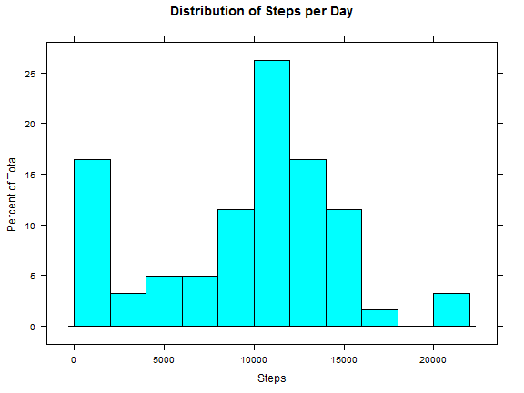
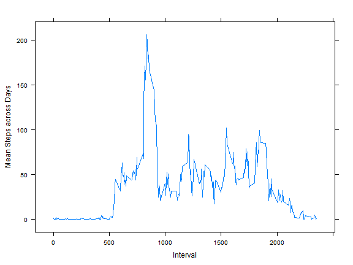
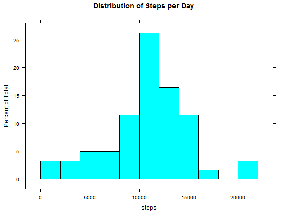
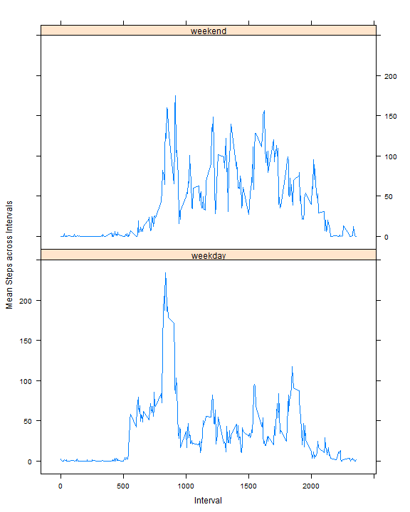

Reproducible Research: Peer Assessment 1
========================================


In the development of this assignment we will work with data obtained from 
personal activity monitoring devices. These measurements are gathered each 5
minutes for every individual through out a day and we will be working with two 
months of data.


The first thing we will do is prepare our environment, including the loading 
of libraries and setting of english language in order to achieve easier 
reproducibility. Note that required libraries need to be installed before 
running any code.


```r
Sys.setenv(LANGUAGE = "en")
Sys.setlocale(category = "LC_ALL", locale = "C")
```

```
## [1] "C"
```

```r
library(lattice)
library(xtable)
library(plyr)
```


## Loading and preprocessing the data

Now let's unzip, load and arrange data from the given file: **activity.zip** 
into a dataframe named **act**.


```r
unzip("activity.zip")
act <- read.csv("activity.csv")
file.remove("activity.csv")
```

```
## [1] TRUE
```


In the remaining sections we will answer the questions required in the 
assignment.


## What is mean total number of steps taken per day?

The first thing we'll do is a summary of the steps per day, with that we build 
the plot below, which shows that most days have a near 10k valid step samples, 
but also there are several days (16% approx.) between 0 and 2k.


```r
dly <- ddply(act, ~date, summarise, Steps = sum(steps, na.rm = T))
histogram(~Steps, data = dly, breaks = 8, main = "Distribution of Steps per Day")
```

 


Now let's see, over daily aggregated data, the mean and median values of the 
total amount of steps per day.


```r
paste("Mean steps over all days: ", round(mean(dly$Steps, na.rm = T), 2))
```

```
## [1] "Mean steps over all days:  9354.23"
```

```r
paste("Median steps over all days: ", median(dly$Steps, na.rm = T))
```

```
## [1] "Median steps over all days:  10395"
```


## What is the average daily activity pattern?

The following time series shows the evolution of the average number of steps 
across all days in the dataset. It was built using a new dataset with the 
mean steps of each interval across the different days in the dataset.


```r
int <- ddply(act, ~interval, summarise, Mean = mean(steps, na.rm = T))
xyplot(Mean ~ interval, data = int, type = "l", xlab = "Interval", ylab = "Mean Steps across Days")
```

 


And this is the 5-minute interval with the maximum average number of steps:

```r
int[int$Mean == max(int$Mean, na.rm = T), "interval"]
```

```
## [1] 835
```


## Imputing missing values

Let's look at the total number of missing values in the dataset


```r
nrow(act[is.na(act$steps), ])
```

```
## [1] 2304
```


With the objective to fill NA's in the dataset we will use mean values for 
each interval and assign that to each NA row in a new data frame.


```r
imp <- act
imp$imputed <- ifelse(is.na(imp$steps), as.integer(merge(imp, int)$Mean), imp$steps)
```


Compare this new histogram of the data with NA's filled with mean steps per 
interval with the first plot in this document.


```r
dli <- ddply(imp, ~date, summarise, steps = sum(steps))
histogram(~steps, data = dli, breaks = 8, main = "Distribution of Steps per Day")
```

 


Also the new mean and median values for the arranged dataset.


```r
paste("Mean steps over all days: ", round(mean(dli$steps, na.rm = T), 2))
```

```
## [1] "Mean steps over all days:  10766.19"
```

```r
paste("Median steps over all days: ", median(dli$steps, na.rm = T))
```

```
## [1] "Median steps over all days:  10765"
```


Note that summarised values differ a lot from original data where only we only 
applied na.rm = T. The histogram now looks more like a normal distribution 
and the mean value is closer to the median.


## Are there differences in activity patterns between weekdays and weekends?

Now let's look at the intervals evolution, comparing weekdays vs. weekends. In 
the following graph we find that the mornings of the weekdays have more activity 
than weekends', what could be justified with most people going to work or to 
school, for example. Weekends on the other hand have a better distribution of 
activity across the whole day, which can make us think that most individuals 
spend their weekdays in activities that require less physical movement compared 
to weekends.


```r
act$weekday <- weekdays(as.POSIXct(strptime(act$date, "%Y-%m-%d")))
act$daycategory <- ifelse(act$weekday %in% c("Saturday", "Sunday"), "weekend", 
    "weekday")
wdy <- ddply(act, ~daycategory + interval, summarise, Mean = mean(steps, na.rm = T))
xyplot(Mean ~ interval | daycategory, data = wdy, type = "l", xlab = "Interval", 
    ylab = "Mean Steps across Intervals", layout = c(1, 2))
```

 


### Dahyr J. Vergara Suarez
